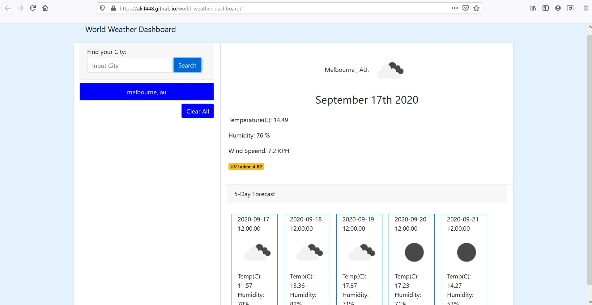

# world-weather-dashboard

=======
A simple weather forecast web appication which allows users to see the weather outlook for multiple cities so that they can plan a trip accordingly.

Using bootstrap and fontawsome libraries a layout is generated ensureing fields are ready to be populated by the data retrived from the use of our 3rd party API> https://openweathermap.org/api.

Registering for a API key that was then used together with JS, Jquery and moment.js to retrieve current and future weather information. This is presented f for the city which the user inputs into the search field. The searched city is then saved in local storage to be retrieved again at a later time. The city searches can be cleared using the 'clear' button.

link to repo: https://github.com/Akif448/world-weather-dashboard
link to live site: https://akif448.github.io/world-weather-dashboard/
